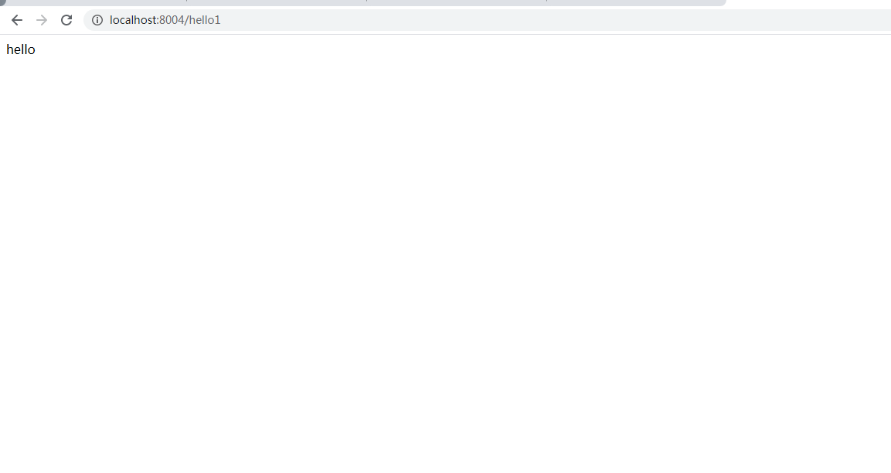
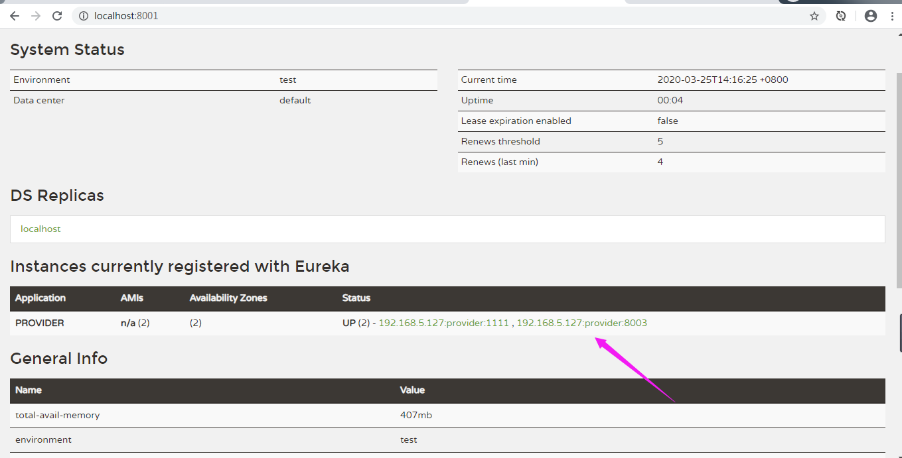
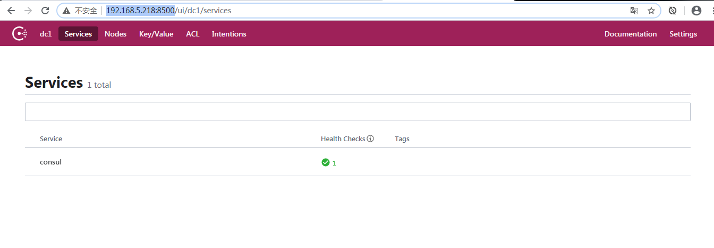
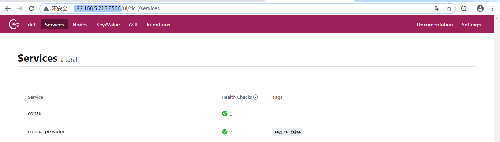
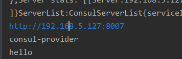

**SpringCloud基本入门知识**

> GitHub地址： [https://github.com/jia707409741/SpringCloud](https://github.com/jia707409741/SpringCloud ) 

QQ交流群：797156985

如需破解jerbrant，请加群：272712006

请关注公众号：窗前居士


## Eureka基本搭建

一、创建一个普通的maven工程（最普通的那种），然后清除里面的src目录。

二、右击工程名，创建SpringBoot工程的子module

​	**添加依赖**

```java
        <dependency>
            <groupId>org.springframework.cloud</groupId>
            <artifactId>spring-cloud-starter-netflix-eureka-server</artifactId>
        </dependency>
```
​	**添加配置**

```pro
spring.application.name=eureka
server.port=8001

#表示当前项目不要注册
eureka.client.register-with-eureka=false
eureka.client.fetch-registry=false
```

​	**启动类上添加Eureka服务注解**

> @EnableEurekaServer

## Eureka服务注册

右击工程名，添加新的SpringBoot模块`provider`

​	**添加依赖**

```java
        <dependency>
            <groupId>org.springframework.cloud</groupId>
            <artifactId>spring-cloud-starter-netflix-eureka-client</artifactId>
        </dependency>

        <dependency>
            <groupId>org.springframework.boot</groupId>
            <artifactId>spring-boot-starter-web</artifactId>
        </dependency>
```

​	**添加配置**

```properties
spring.application.name=provider
server.port=8003
eureka.client.service-url.defaultZone=http://localhost:8001/eureka
```

## 服务消费

首先在`provider`里添加一个接口

```java
@RestController
public class HelloController
{
    @GetMapping("/hello")
    public String hello(){
        return "hello";
    }
}
```

然后我们在创建一个消费者`consumer`，来消费`provider`里的接口

**添加依赖**

```java
        <dependency>
            <groupId>org.springframework.boot</groupId>
            <artifactId>spring-boot-starter-web</artifactId>
        </dependency>
        <dependency>
            <groupId>org.springframework.cloud</groupId>
            <artifactId>spring-cloud-starter-netflix-eureka-client</artifactId>
        </dependency>
```

**添加配置**

```pro
spring.application.name=consumer
server.port=8004
eureka.client.service-url.defaultZone=http://localhost:8001/eureka
```

**调用`provider`代码**

使用HttpURLConnection发起请求，请求地址固定~~

```java
@RestController
public class UserController
{
    HttpURLConnection conn=null;
    @GetMapping("/hello1")
    public String hello() throws MalformedURLException
    {
        try
        {
            URL url = new URL("http://localhost:8003/hello");
            conn= (HttpURLConnection) url.openConnection();
            if(conn.getResponseCode()==200){
                final BufferedReader br = new BufferedReader(new InputStreamReader(conn.getInputStream()));
                final String s = br.readLine();
                br.close();
                return s;
            }
        }
        catch (IOException e)
        {
            e.printStackTrace();
        }
        return "err";
    }
}
```

**最后浏览器结果**



可以看出，这样我们就可以消费服务端提供的接口，但实际上这是写死，是不可能这么写的，否则一个地方要改其他很多地方都要改，所以地址要动态获取。

>旧版本的Eureka需要在服务启动类加上@EnableEurekaClient注解，新版的不需要


**代码改造**

借助Eureka Client的DiscoveryClient，我们可以从Eureka Server中查询到服务的详细信息

```java
    @GetMapping("/hello2")
    public String hello2() throws MalformedURLException
    {
        //他返回的是一个list集合，因为你有可能是集群化部署。
        final List<ServiceInstance> provider = discoveryClient.getInstances("provider");
        final ServiceInstance serviceInstance = provider.get(0);
        final String host = serviceInstance.getHost();//host主机名
        final int port = serviceInstance.getPort();//端口名
        try
        {
            final StringBuffer stringBuffer = new StringBuffer();
            stringBuffer.append("http://")
                    .append(host)
                    .append(":")
                    .append(port)
                    .append("/hello");
            URL url = new URL(stringBuffer.toString());
            conn = (HttpURLConnection) url.openConnection();
            if (conn.getResponseCode() == 200)
            {
                final BufferedReader br = new BufferedReader(new InputStreamReader(conn.getInputStream()));
                final String s = br.readLine();
                br.close();
                return s;
            }
        }
        catch (IOException e)
        {
            e.printStackTrace();
        }
        return "err";
    }
```

> DiscoveryClient查询到的服务列表是一个集合，因为服务在部署过程中，可能是集群化部署。


**集群化部署**

一、改造服务提供者

```java
@RestController
public class HelloController
{
    @Value("${server.port}")
    Integer port;

    @GetMapping("/hello")
    public String hello()
    {
        return "hello"+port;
    }
}
```

二、打包服务提供者，为了开通不同端口

>  java -jar provider-0.0.1-SNAPSHOT.jar --server.port=1111

三、打开注册中心，看是否成功注册



这样的话，DiscoveryClient里的服务实例就不再是一个了，而是两个。

四、手动实现负载均衡

```java
    int count=0;
    @GetMapping("/hello3")
    public String hello3()
    {
        //他返回的是一个list集合，因为你有可能是集群化部署。
        final List<ServiceInstance> provider = discoveryClient.getInstances("provider");
        final ServiceInstance serviceInstance = provider.get((count++) % provider.size());
        final String host = serviceInstance.getHost();//host主机名
        final int port = serviceInstance.getPort();//端口名
        try
        {
            final StringBuffer stringBuffer = new StringBuffer();
            stringBuffer.append("http://")
                    .append(host)
                    .append(":")
                    .append(port)
                    .append("/hello");
            URL url = new URL(stringBuffer.toString());
            conn = (HttpURLConnection) url.openConnection();
            if (conn.getResponseCode() == 200)
            {
                final BufferedReader br = new BufferedReader(new InputStreamReader(conn.getInputStream()));
                final String s = br.readLine();
                br.close();
                return s;
            }
        }
        catch (IOException e)
        {
            e.printStackTrace();
        }
        return "err";
    }
```


访问端口 http://localhost:8004/hello3 ，返回的结果，你会很清楚的看见两个端口来回切换。

## RestTemplate调用服务

一、把RestTemplate注册到spring容器中

```java
    @Bean
    public RestTemplate restTemplateOne()
    {
        return new RestTemplate();
    }

    @Bean
    @LoadBalanced //开启负载均衡，默认算法为轮询
    public RestTemplate restTemplate()
    {
        return new RestTemplate();
    }
```

二、在客户端的控制器里调用服务端接口

```java
	@Autowired
    @Qualifier("restTemplateOne") //作区分的，基础东西，不解释
    RestTemplate restTemplateOne;    
	@GetMapping("/hello2")
    public String hello2()
    {
        //他返回的是一个list集合，因为你有可能是集群化部署。
        final List<ServiceInstance> provider = discoveryClient.getInstances("provider");
        final ServiceInstance serviceInstance = provider.get(0);
        final String host = serviceInstance.getHost();//host主机名
        final int port = serviceInstance.getPort();//端口名
        final StringBuffer stringBuffer = new StringBuffer();
        stringBuffer.append("http://")
                .append(host)
                .append(":")
                .append(port)
                .append("/hello");

        final String s = restTemplateOne.getForObject(stringBuffer.toString(), String.class);
        return s;
    }
```

轮询调用

```java
    @GetMapping("/hello3")
    public String hello3()
    {
        return restTemplate.getForObject("http://provider/hello", String.class);
    }
```

会发现，实现效果都一样，但是代码量明显小了很多。

> 这里我为什么要定义两个bean呢？这两个RestTemplate是不一样的，其中一个调用的是Http的服务，另一个调用的是注册中心的服务，混用的话，解析provider的时候会出错。

### Get

一、首先要在`provider`中定义一个接口

```java
	@GetMapping("/hello2")
    public String hello2(String name)
    {
        return name;
    }
```

二、然后在`consumer`中调用

```java
    @GetMapping("/hello4")
    public void hello4()
    {
        final String s = restTemplate.getForObject("http://provider/hello2?name={1}",
                String.class,"leo");
        System.out.println(s);
        final ResponseEntity<String> s1 = restTemplate.getForEntity("http://provider/hello2?name={1}",String.class, "leo");
        final String body = s1.getBody();
        System.out.println(body);
        final HttpStatus statusCode = s1.getStatusCode();
        System.out.println(statusCode);
    }
//-------控制台打印结果---------
//leo
//leo
//200 OK
```

> 这里有一个注意的地方，getForObject和getForEntity传参的时候，用数字做一种类似于占位符的一种

```java
        String s;
        HashMap<String, Object> map = new HashMap<>();
        map.put("name", "张三");
        s = restTemplate.getForObject("http://provider/hello2?name={name}",
                String.class, map);
//另一种传参方式
```

### Post

一、首先添加一个commons模块，然后分别被provider和consumer两个模块所引用

二、`provider`提供两个接口

```java
    @PostMapping("/user1")	//key/value形式传参
    public User addUser1(User user){
        return user;
    }

    @PostMapping("/user2") //json形式传参
    public User addUser2(@RequestBody User user){
        return user;
    }
```

三、`consumer`消费者

```java
	 @GetMapping("/hello5")
    public void hello5()
    {
        LinkedMultiValueMap<String, Object> map = new LinkedMultiValueMap<>();
        map.add("username","leo");
        map.add("password","123");
        map.add("id",1);
        User user = restTemplate.postForObject("http://provider/user1", map, User.class);
        System.out.println(user);

        user.setId(2);
        user.setUsername("zhbcm");
        user.setPassword("123");
        user = restTemplate.postForObject("http://provider/user2", user, User.class);
        System.out.println(user);
    }
```

一次请求，返回两个post请求的结果

**测试使用postForLocation**

一、`provider`提供一个RegisterController

```java
@Controller
public class RegisterController
{
    @PostMapping("/register")
    public String register(User user){
        return "redirect:http://provider/loginPage?username="+user.getUsername();
    }

    @GetMapping("/loginPage")
    @ResponseBody
    public String loginPage(String username){
        return "login"+username;
    }

```

> 1.因为这里是重定向，响应结果一定是302，否则postForLocation无效
>
> 2.重定向的路径要写成绝对路径，否则consumer中调用会出错

二、`consumer`调用

```java
    @GetMapping("/hello6")
    public void hello6(){
        LinkedMultiValueMap<String, Object> map = new LinkedMultiValueMap<>();
        map.add("username","leo");
        map.add("password","123");
        map.add("id",1);
        URI user = restTemplate.postForLocation("http://provider/register", map);
        String s = restTemplate.getForObject(user, String.class);
        System.out.println(s);
    }
```

### Put

put接口传参其实和post很像也是支持kv形式传参和json形式传参

`provider`提供端

```java
    @PutMapping("/updateUser1")
    public void updateUser1(User user)
    {
        System.out.println(user);
    }

    @PutMapping("/updateUser2")
    public void updateUser2(@RequestBody User user)
    {
        System.out.println(user);
    }
```

`consumer`调用端

```java
	@GetMapping("/hello7")
    public void hello7(){
        LinkedMultiValueMap<String, Object> map = new LinkedMultiValueMap<>();
        map.add("username","leo");
        map.add("password","123");
        map.add("id",1);
        restTemplate.put("http://provider/updateUser1", map);
        //System.out.println(user);
        User user = new User();
        user.setId(2);
        user.setUsername("zhbcm");
        user.setPassword("123");
        restTemplate.put("http://provider/updateUser2", user);
        //System.out.println(user);
    }
```

### Delete

`provider`提供端

```java
    @DeleteMapping("/deleteUser1")
    public void deleteUser1(Integer id)
    {
        System.out.println(id);
    }

    @DeleteMapping("/deleteUser2/{id}")
    public void deleteUser2(@PathVariable Integer id)
    {
        System.out.println(id);
    }
```

`consumer`消费者端

```java
    @GetMapping("/hello8")
    public void hello8(){
       restTemplate.delete("http://provider/deleteUser1?id={1}",1);
       restTemplate.delete("http://provider/deleteUser2/{1}",2);
    }
```


## Consul安装

一、去consul官网去下载Linux安装包，下载慢的可以加群找我，上面两个群号都可以。

二、你可能要安装zip命令，如果你没有的话。

命令： yum list | grep zip/unzip  #获取安装列表

安装命令： yum install zip  #提示输入时，请输入y；

安装命令：yum install unzip #提示输入时，请输入y；

三、解压完成之后，进入consul目录启动

> ./consul agent -dev -ui -node=consul-dev -client=192.168.5.218
>
> 最后放的是你自己虚拟机IP

四、打开浏览器输入 http://192.168.5.218:8500/ ，看到界面显示说明完成。要关闭防火墙。



## Consul使用

### 服务提供端

一、添加依赖

```xml
        <dependency>
            <groupId>org.springframework.boot</groupId>
            <artifactId>spring-boot-starter-actuator</artifactId>
        </dependency>
        <dependency>
            <groupId>org.springframework.boot</groupId>
            <artifactId>spring-boot-starter-web</artifactId>
        </dependency>
        <dependency>
            <groupId>org.springframework.cloud</groupId>
            <artifactId>spring-cloud-starter-consul-discovery</artifactId>
        </dependency>
```

二、添加配置

```properties
spring.application.name=consul-provider
server.port=8007
spring.cloud.consul.host=192.168.5.218
spring.cloud.consul.port=8500
spring.cloud.consul.discovery.service-name=consul-provider
```

三、启动类上加上@EnableDiscoveryClient注解

四、提供者代码

```java
@RestController
public class HelloController
{
    @GetMapping("/hello")
    public String hello(){
        return "hello";
    }
}
```

最后启动服务



### 服务消费端

一、添加依赖

```xml
        <dependency>
            <groupId>org.springframework.boot</groupId>
            <artifactId>spring-boot-starter-actuator</artifactId>
        </dependency>
        <dependency>
            <groupId>org.springframework.boot</groupId>
            <artifactId>spring-boot-starter-web</artifactId>
        </dependency>
        <dependency>
            <groupId>org.springframework.cloud</groupId>
            <artifactId>spring-cloud-starter-consul-discovery</artifactId>
        </dependency>
```

二、添加配置

```properties
spring.application.name=consul-provider
server.port=8008
spring.cloud.consul.host=192.168.5.218
spring.cloud.consul.port=8500
spring.cloud.consul.discovery.service-name=consul-provider
```

三、启动类上加上@EnableDiscoveryClient注解

```java
@SpringBootApplication
@EnableDiscoveryClient
public class ConsulConsumerApplication
{
    public static void main(String[] args)
    {
        SpringApplication.run(ConsulConsumerApplication.class, args);
    }

    @Bean
    RestTemplate restTemplate()
    {
        return new RestTemplate();
    }
}
```

四、消费者调用

```java
@RestController
public class HelloController
{
    @Autowired
    LoadBalancerClient client;
    @Autowired
    RestTemplate restTemplate;

    @GetMapping("/hello")
    public void hello()
    {
        ServiceInstance choose = client.choose("consul-provider");
        System.out.println(choose.getUri());
        System.out.println(choose.getServiceId());
        String s = restTemplate.getForObject(choose.getUri() + "/hello", String.class);
        System.out.println(s);
    }
}
```

最后在浏览器输入： http://localhost:8008/hello 

控制台打印成功：



