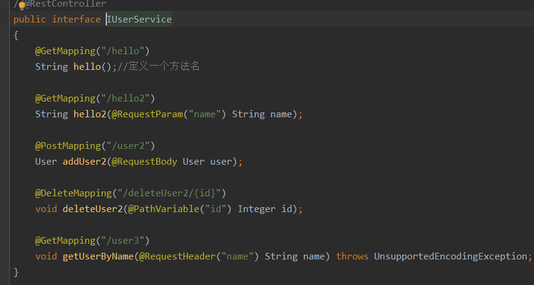
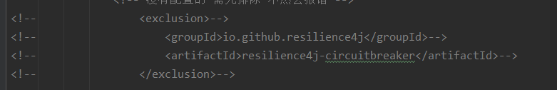
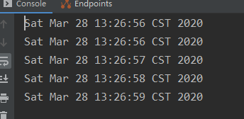
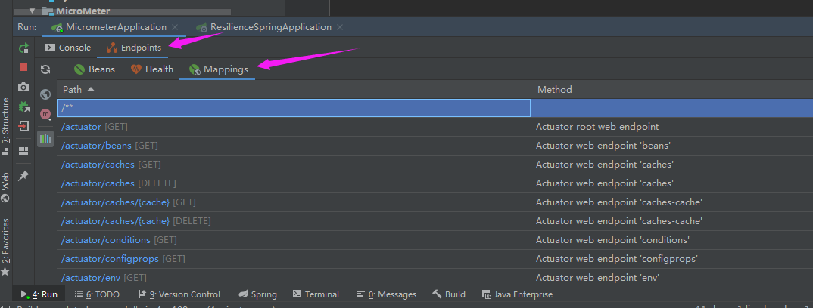

**SpringCloud基本入门知识**

> GitHub地址： [https://github.com/jia707409741/SpringCloud](https://github.com/jia707409741/SpringCloud ) 

QQ交流群：797156985

如需破解jerbrant，请加群：272712006

请关注公众号：窗前居士


## Eureka基本搭建

一、创建一个普通的maven工程（最普通的那种），然后清除里面的src目录。

二、右击工程名，创建SpringBoot工程的子module

​	**添加依赖**

```java
        <dependency>
            <groupId>org.springframework.cloud</groupId>
            <artifactId>spring-cloud-starter-netflix-eureka-server</artifactId>
        </dependency>
```
​	**添加配置**

```pro
spring.application.name=eureka
server.port=8001

#表示当前项目不要注册
eureka.client.register-with-eureka=false
eureka.client.fetch-registry=false
```

​	**启动类上添加Eureka服务注解**

> @EnableEurekaServer

## Eureka简单入门

### Eureka服务注册

右击工程名，添加新的SpringBoot模块`provider`

​	**添加依赖**

```java
        <dependency>
            <groupId>org.springframework.cloud</groupId>
            <artifactId>spring-cloud-starter-netflix-eureka-client</artifactId>
        </dependency>

        <dependency>
            <groupId>org.springframework.boot</groupId>
            <artifactId>spring-boot-starter-web</artifactId>
        </dependency>
```

​	**添加配置**

```properties
spring.application.name=provider
server.port=8003
eureka.client.service-url.defaultZone=http://localhost:8001/eureka
```

### Eureka服务消费

首先在`provider`里添加一个接口

```java
@RestController
public class HelloController
{
    @GetMapping("/hello")
    public String hello(){
        return "hello";
    }
}
```

然后我们在创建一个消费者`consumer`，来消费`provider`里的接口

**添加依赖**

```java
        <dependency>
            <groupId>org.springframework.boot</groupId>
            <artifactId>spring-boot-starter-web</artifactId>
        </dependency>
        <dependency>
            <groupId>org.springframework.cloud</groupId>
            <artifactId>spring-cloud-starter-netflix-eureka-client</artifactId>
        </dependency>
```

**添加配置**

```pro
spring.application.name=consumer
server.port=8004
eureka.client.service-url.defaultZone=http://localhost:8001/eureka
```

**调用`provider`代码**

使用HttpURLConnection发起请求，请求地址固定~~

```java
@RestController
public class UserController
{
    HttpURLConnection conn=null;
    @GetMapping("/hello1")
    public String hello() throws MalformedURLException
    {
        try
        {
            URL url = new URL("http://localhost:8003/hello");
            conn= (HttpURLConnection) url.openConnection();
            if(conn.getResponseCode()==200){
                final BufferedReader br = new BufferedReader(new InputStreamReader(conn.getInputStream()));
                final String s = br.readLine();
                br.close();
                return s;
            }
        }
        catch (IOException e)
        {
            e.printStackTrace();
        }
        return "err";
    }
}
```

**最后浏览器结果**


可以看出，这样我们就可以消费服务端提供的接口，但实际上这是写死，是不可能这么写的，否则一个地方要改其他很多地方都要改，所以地址要动态获取。

>旧版本的Eureka需要在服务启动类加上@EnableEurekaClient注解，新版的不需要


**代码改造**

借助Eureka Client的DiscoveryClient，我们可以从Eureka Server中查询到服务的详细信息

```java
    @GetMapping("/hello2")
    public String hello2() throws MalformedURLException
    {
        //他返回的是一个list集合，因为你有可能是集群化部署。
        final List<ServiceInstance> provider = discoveryClient.getInstances("provider");
        final ServiceInstance serviceInstance = provider.get(0);
        final String host = serviceInstance.getHost();//host主机名
        final int port = serviceInstance.getPort();//端口名
        try
        {
            final StringBuffer stringBuffer = new StringBuffer();
            stringBuffer.append("http://")
                    .append(host)
                    .append(":")
                    .append(port)
                    .append("/hello");
            URL url = new URL(stringBuffer.toString());
            conn = (HttpURLConnection) url.openConnection();
            if (conn.getResponseCode() == 200)
            {
                final BufferedReader br = new BufferedReader(new InputStreamReader(conn.getInputStream()));
                final String s = br.readLine();
                br.close();
                return s;
            }
        }
        catch (IOException e)
        {
            e.printStackTrace();
        }
        return "err";
    }
```

> DiscoveryClient查询到的服务列表是一个集合，因为服务在部署过程中，可能是集群化部署。


**集群化部署**

一、改造服务提供者

```java
@RestController
public class HelloController
{
    @Value("${server.port}")
    Integer port;

    @GetMapping("/hello")
    public String hello()
    {
        return "hello"+port;
    }
}
```

二、打包服务提供者，为了开通不同端口

>  java -jar provider-0.0.1-SNAPSHOT.jar --server.port=1111

三、打开注册中心，看是否成功注册


这样的话，DiscoveryClient里的服务实例就不再是一个了，而是两个。

四、手动实现负载均衡

```java
    int count=0;
    @GetMapping("/hello3")
    public String hello3()
    {
        //他返回的是一个list集合，因为你有可能是集群化部署。
        final List<ServiceInstance> provider = discoveryClient.getInstances("provider");
        final ServiceInstance serviceInstance = provider.get((count++) % provider.size());
        final String host = serviceInstance.getHost();//host主机名
        final int port = serviceInstance.getPort();//端口名
        try
        {
            final StringBuffer stringBuffer = new StringBuffer();
            stringBuffer.append("http://")
                    .append(host)
                    .append(":")
                    .append(port)
                    .append("/hello");
            URL url = new URL(stringBuffer.toString());
            conn = (HttpURLConnection) url.openConnection();
            if (conn.getResponseCode() == 200)
            {
                final BufferedReader br = new BufferedReader(new InputStreamReader(conn.getInputStream()));
                final String s = br.readLine();
                br.close();
                return s;
            }
        }
        catch (IOException e)
        {
            e.printStackTrace();
        }
        return "err";
    }
```


访问端口 http://localhost:8004/hello3 ，返回的结果，你会很清楚的看见两个端口来回切换。

## RestTemplate调用服务

一、把RestTemplate注册到spring容器中

```java
    @Bean
    public RestTemplate restTemplateOne()
    {
        return new RestTemplate();
    }

    @Bean
    @LoadBalanced //开启负载均衡，默认算法为轮询
    public RestTemplate restTemplate()
    {
        return new RestTemplate();
    }
```

二、在客户端的控制器里调用服务端接口

```java
	@Autowired
    @Qualifier("restTemplateOne") //作区分的，基础东西，不解释
    RestTemplate restTemplateOne;    
	@GetMapping("/hello2")
    public String hello2()
    {
        //他返回的是一个list集合，因为你有可能是集群化部署。
        final List<ServiceInstance> provider = discoveryClient.getInstances("provider");
        final ServiceInstance serviceInstance = provider.get(0);
        final String host = serviceInstance.getHost();//host主机名
        final int port = serviceInstance.getPort();//端口名
        final StringBuffer stringBuffer = new StringBuffer();
        stringBuffer.append("http://")
                .append(host)
                .append(":")
                .append(port)
                .append("/hello");

        final String s = restTemplateOne.getForObject(stringBuffer.toString(), String.class);
        return s;
    }
```

轮询调用

```java
    @GetMapping("/hello3")
    public String hello3()
    {
        return restTemplate.getForObject("http://provider/hello", String.class);
    }
```

会发现，实现效果都一样，但是代码量明显小了很多。

> 这里我为什么要定义两个bean呢？这两个RestTemplate是不一样的，其中一个调用的是Http的服务，另一个调用的是注册中心的服务，混用的话，解析provider的时候会出错。

### Get

一、首先要在`provider`中定义一个接口

```java
	@GetMapping("/hello2")
    public String hello2(String name)
    {
        return name;
    }
```

二、然后在`consumer`中调用

```java
    @GetMapping("/hello4")
    public void hello4()
    {
        final String s = restTemplate.getForObject("http://provider/hello2?name={1}",
                String.class,"leo");
        System.out.println(s);
        final ResponseEntity<String> s1 = restTemplate.getForEntity("http://provider/hello2?name={1}",String.class, "leo");
        final String body = s1.getBody();
        System.out.println(body);
        final HttpStatus statusCode = s1.getStatusCode();
        System.out.println(statusCode);
    }
//-------控制台打印结果---------
//leo
//leo
//200 OK
```

> 这里有一个注意的地方，getForObject和getForEntity传参的时候，用数字做一种类似于占位符的一种

```java
        String s;
        HashMap<String, Object> map = new HashMap<>();
        map.put("name", "张三");
        s = restTemplate.getForObject("http://provider/hello2?name={name}",
                String.class, map);
//另一种传参方式
```

### Post

一、首先添加一个commons模块，然后分别被provider和consumer两个模块所引用

二、`provider`提供两个接口

```java
    @PostMapping("/user1")	//key/value形式传参
    public User addUser1(User user){
        return user;
    }

    @PostMapping("/user2") //json形式传参
    public User addUser2(@RequestBody User user){
        return user;
    }
```

三、`consumer`消费者

```java
	 @GetMapping("/hello5")
    public void hello5()
    {
        LinkedMultiValueMap<String, Object> map = new LinkedMultiValueMap<>();
        map.add("username","leo");
        map.add("password","123");
        map.add("id",1);
        User user = restTemplate.postForObject("http://provider/user1", map, User.class);
        System.out.println(user);

        user.setId(2);
        user.setUsername("zhbcm");
        user.setPassword("123");
        user = restTemplate.postForObject("http://provider/user2", user, User.class);
        System.out.println(user);
    }
```

一次请求，返回两个post请求的结果

**测试使用postForLocation**

一、`provider`提供一个RegisterController

```java
@Controller
public class RegisterController
{
    @PostMapping("/register")
    public String register(User user){
        return "redirect:http://provider/loginPage?username="+user.getUsername();
    }

    @GetMapping("/loginPage")
    @ResponseBody
    public String loginPage(String username){
        return "login"+username;
    }

```

> 1.因为这里是重定向，响应结果一定是302，否则postForLocation无效
>
> 2.重定向的路径要写成绝对路径，否则consumer中调用会出错

二、`consumer`调用

```java
    @GetMapping("/hello6")
    public void hello6(){
        LinkedMultiValueMap<String, Object> map = new LinkedMultiValueMap<>();
        map.add("username","leo");
        map.add("password","123");
        map.add("id",1);
        URI user = restTemplate.postForLocation("http://provider/register", map);
        String s = restTemplate.getForObject(user, String.class);
        System.out.println(s);
    }
```

### Put

put接口传参其实和post很像也是支持kv形式传参和json形式传参

`provider`提供端

```java
    @PutMapping("/updateUser1")
    public void updateUser1(User user)
    {
        System.out.println(user);
    }

    @PutMapping("/updateUser2")
    public void updateUser2(@RequestBody User user)
    {
        System.out.println(user);
    }
```

`consumer`调用端

```java
	@GetMapping("/hello7")
    public void hello7(){
        LinkedMultiValueMap<String, Object> map = new LinkedMultiValueMap<>();
        map.add("username","leo");
        map.add("password","123");
        map.add("id",1);
        restTemplate.put("http://provider/updateUser1", map);
        //System.out.println(user);
        User user = new User();
        user.setId(2);
        user.setUsername("zhbcm");
        user.setPassword("123");
        restTemplate.put("http://provider/updateUser2", user);
        //System.out.println(user);
    }
```

### Delete

`provider`提供端

```java
    @DeleteMapping("/deleteUser1")
    public void deleteUser1(Integer id)
    {
        System.out.println(id);
    }

    @DeleteMapping("/deleteUser2/{id}")
    public void deleteUser2(@PathVariable Integer id)
    {
        System.out.println(id);
    }
```

`consumer`消费者端

```java
    @GetMapping("/hello8")
    public void hello8(){
       restTemplate.delete("http://provider/deleteUser1?id={1}",1);
       restTemplate.delete("http://provider/deleteUser2/{1}",2);
    }
```


## Consul简单入门

### Consul安装

一、去consul官网去下载Linux安装包，下载慢的可以加群找我，上面两个群号都可以。

二、你可能要安装zip命令，如果你没有的话。

命令： yum list | grep zip/unzip  #获取安装列表

安装命令： yum install zip  #提示输入时，请输入y；

安装命令：yum install unzip #提示输入时，请输入y；

三、解压完成之后，进入consul目录启动

> ./consul agent -dev -ui -node=consul-dev -client=192.168.5.218
>
> 最后放的是你自己虚拟机IP

四、打开浏览器输入 http://192.168.5.218:8500/ ，看到界面显示说明完成。要关闭防火墙。


### Consul使用

#### 服务提供端

一、添加依赖

```xml
        <dependency>
            <groupId>org.springframework.boot</groupId>
            <artifactId>spring-boot-starter-actuator</artifactId>
        </dependency>
        <dependency>
            <groupId>org.springframework.boot</groupId>
            <artifactId>spring-boot-starter-web</artifactId>
        </dependency>
        <dependency>
            <groupId>org.springframework.cloud</groupId>
            <artifactId>spring-cloud-starter-consul-discovery</artifactId>
        </dependency>
```

二、添加配置

```properties
spring.application.name=consul-provider
server.port=8007
spring.cloud.consul.host=192.168.5.218
spring.cloud.consul.port=8500
spring.cloud.consul.discovery.service-name=consul-provider
```

三、启动类上加上@EnableDiscoveryClient注解

四、提供者代码

```java
@RestController
public class HelloController
{
    @GetMapping("/hello")
    public String hello(){
        return "hello";
    }
}
```

最后启动服务


#### 服务消费端

一、添加依赖

```xml
        <dependency>
            <groupId>org.springframework.boot</groupId>
            <artifactId>spring-boot-starter-actuator</artifactId>
        </dependency>
        <dependency>
            <groupId>org.springframework.boot</groupId>
            <artifactId>spring-boot-starter-web</artifactId>
        </dependency>
        <dependency>
            <groupId>org.springframework.cloud</groupId>
            <artifactId>spring-cloud-starter-consul-discovery</artifactId>
        </dependency>
```

二、添加配置

```properties
spring.application.name=consul-provider
server.port=8008
spring.cloud.consul.host=192.168.5.218
spring.cloud.consul.port=8500
spring.cloud.consul.discovery.service-name=consul-provider
```

三、启动类上加上@EnableDiscoveryClient注解

```java
@SpringBootApplication
@EnableDiscoveryClient
public class ConsulConsumerApplication
{
    public static void main(String[] args)
    {
        SpringApplication.run(ConsulConsumerApplication.class, args);
    }

    @Bean
    RestTemplate restTemplate()
    {
        return new RestTemplate();
    }
}
```

四、消费者调用

```java
@RestController
public class HelloController
{
    @Autowired
    LoadBalancerClient client;
    @Autowired
    RestTemplate restTemplate;

    @GetMapping("/hello")
    public void hello()
    {
        ServiceInstance choose = client.choose("consul-provider");
        System.out.println(choose.getUri());
        System.out.println(choose.getServiceId());
        String s = restTemplate.getForObject(choose.getUri() + "/hello", String.class);
        System.out.println(s);
    }
}
```

最后在浏览器输入： http://localhost:8008/hello 

控制台打印成功：


## Hystrix

### Hystrix基本介绍

> Hystrix叫做熔断器，在微服务系统中，一个项目可能会牵涉多个系统，任何一个模块出错可能会导致整个系统出问题。所以我们希望可以有一样东西，如果某一个模块出错，不再影响整个系统！

### Hystrix基本使用

一、添加依赖

```xml
		<dependency>
            <groupId>org.springframework.boot</groupId>
            <artifactId>spring-boot-starter-web</artifactId>
        </dependency>
        <dependency>
            <groupId>org.springframework.cloud</groupId>
            <artifactId>spring-cloud-starter-netflix-eureka-client</artifactId>
        </dependency>
        <dependency>
            <groupId>org.springframework.cloud</groupId>
            <artifactId>spring-cloud-starter-netflix-hystrix</artifactId>
        </dependency>

```

二、添加配置

```properties
spring.application.name=hystrix
server.port=8009
eureka.client.service-url.defaultZone=http://localhost:8001/eureka

```

三、启动类配置

```java
@SpringBootApplication
@EnableCircuitBreaker
//@SpringCloudApplication可以使用这个注解来代替、

public class HystrixApplication
{
    public static void main(String[] args)
    {
        SpringApplication.run(HystrixApplication.class, args);
    }

    @Bean
    @LoadBalanced
    RestTemplate restTemplate()
    {
        return new RestTemplate();
    }
}
```

> 关于@SpringCloudApplication解释，他和@SpringBootApplication差不多，是一种复合注解，其源码如下：

```java
@Target({ElementType.TYPE})
@Retention(RetentionPolicy.RUNTIME)
@Documented
@Inherited
@SpringBootApplication
@EnableDiscoveryClient
@EnableCircuitBreaker
public @interface SpringCloudApplication {
}
```

可以看出这个注解是@SpringBootApplication、@EnableDiscoveryClient、@EnableCircuitBreaker三个注解的组合。

四、核心代码

HelloService.java

```java
@Service
public class HelloService
{
    @Autowired
    RestTemplate restTemplate;

    /**
     * 我们将调用provider里的hello接口，但是这个调用可能会失败，所以我们要在这个方法上加上
     * @HystrixCommand注解，配置里面fallbackMethod的属性，表示调用该方法失败时，会调用临时
     * 的一个替代方法。
     */
    @HystrixCommand(fallbackMethod = "error")//服务降级
    public String hello()
    {
        return restTemplate.getForObject("http://provider/hello", String.class);
    }
    /**
     * @description：
     * 名字要和fallbackMethod返回值一致，方法返回值也要一致。总不能上面失败的方法返回是String类型
     * 你下面定义的临时调用方法返回Integer类型，这显然是不行的。
     * @since v1.0.0
     * author Leo
     * date 2020/3/26
     */
    public String error()
    {
        return "error";
    }
}
```

HelloController.java

```java
@RestController
public class HelloController
{
    @Autowired
    HelloService helloService;

    @GetMapping("/hello")
    public String hello(){
        return helloService.hello();
    }
}

```

最后，测试的时候如果出现问题的话，会出现error。

### Hystrix请求命令

一、创建Command.java继承HystrixCommand<T>

```java
public class Command extends HystrixCommand<String>
{
    RestTemplate restTemplate;

    public Command(Setter setter, RestTemplate restTemplate)
    {
        super(setter);
        this.restTemplate = restTemplate;
    }

    @Override
    protected String run() throws Exception
    {
        return restTemplate.getForObject("http://provider/hello",String.class);
    }
}
```

二、调用方法

```java
    @Autowired
    RestTemplate restTemplate;

    @GetMapping("/hello2")
    public void hello2(){
        Command command = new Command(HystrixCommand.Setter.
                withGroupKey(HystrixCommandGroupKey.Factory.asKey("leo")), restTemplate);
//        String execute = command.execute();//直接执行
//        System.out.println(execute);
        try
        {
            Future<String> queue = command.queue();
            String s = queue.get();
            System.out.println(s);//先入队后执行
        }
        catch (InterruptedException e)
        {
            e.printStackTrace();
        }
        catch (ExecutionException e)
        {
            e.printStackTrace();
        }
    }
```

> 这里一个实例只能执行一次，所以如果通过execute方法执行，就不要使用queue。

### Hystrix注解方式异步调用

首先定义如下方法

```java
    @HystrixCommand(fallbackMethod = "error")
    public Future<String> hello2(){
        return new AsyncResult<String>(){
            @Override
            public String invoke()
            {
                return restTemplate.getForObject("http://provider/hello",String.class);
            }
        };
    }
```

调用方法

```java
   @GetMapping("/hello3")
    public void hello3(){
        Future<String> future = helloService.hello2();
        try
        {
            String s = future.get();
            System.out.println(s);
        }
        catch (InterruptedException e)
        {
            e.printStackTrace();
        }
        catch (ExecutionException e)
        {
            e.printStackTrace();
        }
    }
```

### Hystrix请求缓存

一、首先修改`provider`的hello2接口

```java
    @GetMapping("/hello2")
    public String hello2(String name)
    {
        System.out.println(new Date()+"--->"+name);
        return name;
    }
```

二、在断路器中添加代码

HelloService.java

```java
    @HystrixCommand(fallbackMethod = "error2")
    @CacheResult //这个注解表示该方法的请求结果会被缓存起来，缓存key就是参数，value就是方法的返回值
    public String hello3(String name){
        return restTemplate.getForObject("http://provider/hello2?name={1}",String.class,name);
    }

    public String error2(String name)
    {
        return "error"+name;
    }
```

> 然而，这样配置完成之后，缓存并不会立即生效，一般来说缓存都有一个生命周期，所以这里也是，需要进行初始化HystrixRequestContext，才可以生效。close之后缓存失效。

```java
    @GetMapping("/hello4")
    public void hello4(){
        HystrixRequestContext ctx = HystrixRequestContext.initializeContext();
        String s = helloService.hello3("leo");
        s = helloService.hello3("leo");
        ctx.close();
    }
```

发起请求： http://localhost:8009/hello4 

`返回结果：`Thu Mar 26 17:18:10 CST 2020--->leo

他只返回了一次，说明第二次返回的结果是读取第一次的缓存。

### Hystrix请求合并

*非注解形式，配置复杂！*

`provider`接口定义

```java
@RestController
public class UserController
{
    @GetMapping("/user/{ids}")
    public List<User> getUserByIds(@PathVariable String ids){
        System.out.println(ids);
        String[] split = ids.split(",");
        ArrayList<User> list = new ArrayList<>();
        for (String s : split)
        {
            User user = new User();
            user.setId(Integer.parseInt(s));
            list.add(user);
        }
        return list;
    }
}
```

在`hystrix`定义UserService

```java
@Service
public class UserService
{
    @Autowired
    RestTemplate restTemplate;
    public List<User> getUserByIds(List<Integer> ids){
        User[] users = restTemplate.getForObject("http://provider/user/{1}", User[].class, StringUtils.join(ids, ','));
        return Arrays.asList(users);
    }
}

```

定义UserBatchCommand

```java
public class UserBatchCommand extends HystrixCommand<List<User>>
{
    private List<Integer> ids;
    private UserService userService;

    @Override
    protected List<User> run() throws Exception
    {
        return userService.getUserByIds(ids);
    }

    public UserBatchCommand(List<Integer> ids, UserService userService)
    {
        super(HystrixCommand.Setter.withGroupKey(HystrixCommandGroupKey.Factory.asKey("batchCmd"))
                .andCommandKey(HystrixCommandKey.Factory.asKey("batchKey")));
        this.ids = ids;
        this.userService = userService;
    }
}

```

定义请求合并的方法

```java
public class UserCollapseCommand extends HystrixCollapser<List<User>, User, Integer>
{
    private UserService userService;
    private Integer id;

    public UserCollapseCommand(UserService userService, Integer id)
    {
        super(HystrixCollapser.Setter.withCollapserKey(HystrixCollapserKey.Factory.asKey("UserCollapseCommand"))
                .andCollapserPropertiesDefaults(HystrixCollapserProperties.Setter()
                        .withTimerDelayInMilliseconds(200)));
        this.userService = userService;
        this.id = id;
    }

    //返回请求参数
    @Override
    public Integer getRequestArgument()
    {
        return id;
    }

    //请求合并方法
    @Override
    protected HystrixCommand<List<User>> createCommand(Collection<CollapsedRequest<User, Integer>> collection)
    {
        ArrayList<Integer> ids = new ArrayList<>(collection.size());
        for (CollapsedRequest<User, Integer> request : collection)
        {
            ids.add(request.getArgument());
        }
        return new UserBatchCommand(ids,userService);
    }

    //请求结果分发
    @Override
    protected void mapResponseToRequests(List<User> users, Collection<CollapsedRequest<User, Integer>> collection)
    {
        int count=0;
        for (CollapsedRequest<User, Integer> request : collection)
        {
            request.setResponse(users.get(count++));
        }
    }
}

```

最后调试

```java
@GetMapping("/hello5")
    public void hello5() throws ExecutionException, InterruptedException
    {
        HystrixRequestContext ctx = HystrixRequestContext.initializeContext();
        UserCollapseCommand cmd1 = new UserCollapseCommand(userService, 99);
        UserCollapseCommand cmd2 = new UserCollapseCommand(userService, 98);
        UserCollapseCommand cmd3 = new UserCollapseCommand(userService, 97);
        UserCollapseCommand cmd4 = new UserCollapseCommand(userService, 96);
        Future<User> queue1 = cmd1.queue();
        Future<User> queue2 = cmd2.queue();
        Future<User> queue3 = cmd3.queue();
        Future<User> queue4 = cmd4.queue();
        User user1 = queue1.get();
        User user2 = queue2.get();
        User user3 = queue3.get();
        User user4 = queue4.get();
        System.out.println(user1);
        System.out.println(user2);
        System.out.println(user3);
        System.out.println(user4);
        ctx.close();
    }
```

从控制台打印我们可以看到

> 96,97,98,99

四次请求被合在一起打印到了控制台上~如果想看出效果，可以使用延迟加载来实现。


*注解形式配置*

UserService.java

```java
@Service
public class UserService
{
    @Autowired
    RestTemplate restTemplate;

    @HystrixCollapser(batchMethod = "getUserByIds", collapserProperties = {@HystrixProperty(name = "timerDelayInMilliseconds", value = "200")})
    public Future<User> getUsersById(Integer id)
    {
        return null;
    }

    @HystrixCommand
    public List<User> getUserByIds(List<Integer> ids)
    {
        User[] users = restTemplate.getForObject("http://provider/user/{1}", User[].class, StringUtils.join(ids, ','));
        return Arrays.asList(users);
    }
}
```

测试方法

```java
    @GetMapping("/hello6")
    public void hello6() throws ExecutionException, InterruptedException
    {
        HystrixRequestContext ctx = HystrixRequestContext.initializeContext();
        Future<User> q1 = userService.getUsersById(99);
        Future<User> q2 = userService.getUsersById(98);
        Future<User> q3 = userService.getUsersById(97);
        User user1 = q1.get();
        User user2 = q2.get();
        User user3 = q3.get();
        System.out.println(user1);
        System.out.println(user2);
        System.out.println(user3);
        Thread.sleep(2000);
        Future<User> q4 = userService.getUsersById(97);
        User user4 = q4.get();
        System.out.println(user4);
        ctx.close();
    }
```

控制台打印结果：

User{id=99, username='null', password='null'}
User{id=98, username='null', password='null'}
User{id=97, username='null', password='null'}
2020-03-26 20:26:49.127  INFO 9264 --- [erListUpdater-0] c.netflix.config.ChainedDynamicProperty  : Flipping property: provider.ribbon.ActiveConnectionsLimit to use NEXT property: niws.loadbalancer.availabilityFilteringRule.activeConnectionsLimit = 2147483647
User{id=97, username='null', password='null'}

## OpenFeign简单入门

### HelloWorld

一、添加依赖

```properties
        <dependency>
            <groupId>org.springframework.boot</groupId>
            <artifactId>spring-boot-starter-web</artifactId>
        </dependency>
        <dependency>
            <groupId>org.springframework.cloud</groupId>
            <artifactId>spring-cloud-starter-netflix-eureka-client</artifactId>
        </dependency>
        <dependency>
            <groupId>org.springframework.cloud</groupId>
            <artifactId>spring-cloud-starter-openfeign</artifactId>
        </dependency>

```

二、配置文件，使项目注册到Eureka上

```properties
spring.application.name=openfeign
server.port=7000
eureka.client.service-url.defaultZone=http://localhost:8001/eureka
```

三、启动类上添加注解，开启对feign的支持

@EnableFeignClients

四、定义service接口

```java
@FeignClient("provider")//绑定服务，服务提供者的spring.application.name=provider
public interface HelloService
{
    @GetMapping("/hello")
    String hello();//定义一个方法名
}
```

定义controller

```java
@RestController
public class HelloController
{
    @Autowired
    HelloService helloService;

    @GetMapping("/hello")
    public String hello(){
        return helloService.hello();
    }
}

```

五、启动服务

启动Eureka、Provider再启动Feign

然后控制台输入： http://localhost:7000/hello 

### OpenFeign参数传递

和普通参数传递的区别

> 1.参数要绑定参数名
>
> 2.如果通过header来传递参数，要记得中文转码

一、测试接口

```java
@FeignClient("provider")//绑定服务
public interface HelloService
{
    @GetMapping("/hello")
    String hello();//定义一个方法名

    @GetMapping("/hello2")
    String hello2(@RequestParam("name") String name);

    @PostMapping("/user2")
    User addUser(@RequestBody User user);

    @DeleteMapping("/deleteUser2/{id}")
    void deleteUserById(@PathVariable("id") Integer id);

    @GetMapping("/user3")
    void getUserByName(@RequestHeader("name") String name);
}

```

二、调用接口

```java
	@GetMapping("/hello2")
    public String hello2() throws UnsupportedEncodingException
    {
        String s = helloService.hello2("leo");
        System.out.println(s);
        User user = new User();
        user.setId(1);
        user.setUsername("leo");
        user.setPassword("123");
        User user1 = helloService.addUser(user);
        System.out.println(user1);
        helloService.deleteUserById(1);
        helloService.getUserByName(URLEncoder.encode("leo","UTF-8"));
        return helloService.hello();
    }
```

> Feign调用相比之前的RestTemplate，在代码上明显更加简洁、方便。Feign主要是通过Service接口绑定对应的远程服务，在接口上使用Mapping映射，这是最大的特点！至此，Service与服务提供者绑定后，控制器再进行调用！

### OpenFeign继承特性

将`provider`和`OpenFeign`中公共的部分提取出来，一起使用！

一、首先创建一个普通的maven工程，这个工程需要web依赖和common模块的依赖

```properties
    <dependencies>
        <dependency>
            <groupId>org.springframework.boot</groupId>
            <artifactId>spring-boot-starter-web</artifactId>
            <version>2.2.5.RELEASE</version>
        </dependency>
        <dependency>
            <groupId>leo.study</groupId>
            <artifactId>common</artifactId>
            <version>1.0-SNAPSHOT</version>
        </dependency>
```

二、创建公共接口

```java
public interface IUserService
{
    @GetMapping("/hello")
    String hello();//定义一个方法名

    @GetMapping("/hello2")
    String hello2(@RequestParam("name") String name);

    @PostMapping("/user2")
    User addUser2(@RequestBody User user);

    @DeleteMapping("/deleteUser2/{id}")
    void deleteUser2(@PathVariable("id") Integer id);

    @GetMapping("/user3")
    void getUserByName(@RequestHeader("name") String name) throws UnsupportedEncodingException;
}

```

三、把抽好的模块放到provider和OpenFeign里

```properties
<dependency>
            <artifactId>feign-api</artifactId>
            <groupId>leo.study</groupId>
            <version>1.0-SNAPSHOT</version>
        </dependency>
```

四、provider实现接口

```java
@RestController
public class HelloController implements IUserService
{
    @Value("${server.port}")
    Integer port;

    @Override
//    @GetMapping("/hello") 因为实现了接口，映射关系随着接口的实现被带过来了
    public String hello()
    {
        return "hello" + port;
    }

    @Override
//    @GetMapping("/hello2")
    public String hello2(String name)
    {
        System.out.println(new Date()+"--->"+name);
        return name;
    }

    @PostMapping("/user1")
    public User addUser1(User user)
    {
        return user;
    }

//    @PostMapping("/user2")
    @Override
    public User addUser2(@RequestBody User user)
    {
        return user;
    }

    @PutMapping("/updateUser1")
    public void updateUser1(User user)
    {
        System.out.println(user);
    }

    @PutMapping("/updateUser2")
    public void updateUser2(@RequestBody User user)
    {
        System.out.println(user);
    }

    @DeleteMapping("/deleteUser1")
    public void deleteUser1(Integer id)
    {
        System.out.println(id);
    }

//    @DeleteMapping("/deleteUser2/{id}")
    @Override
    public void deleteUser2(@PathVariable Integer id)
    {
        System.out.println(id);
    }

//    @GetMapping("/user3")
    @Override
    public void getUserByName(@RequestHeader String name) throws UnsupportedEncodingException
    {
        System.out.println(URLDecoder.decode(name, "UTF-8"));
    }
}
```

> `注意：` 因为实现了接口，映射关系随着接口的实现被带过来了，所以在重新继承之后，映射关系可以省略。

五、`OpenFeign`继承公共模块`IUserService`

只需要继承就可以！

```java
@FeignClient("provider")//绑定服务
public interface HelloService extends IUserService
{
    /**
     * author Leo
     * date 2020/3/27

    @GetMapping("/hello")
    String hello();//定义一个方法名

    @GetMapping("/hello2")
    String hello2(@RequestParam("name") String name);

    @PostMapping("/user2")
    User addUser(@RequestBody User user);

    @DeleteMapping("/deleteUser2/{id}")
    void deleteUserById(@PathVariable("id") Integer id);

    @GetMapping("/user3")
    void getUserByName(@RequestHeader("name") String name);
     */
}
```

关于继承特性：代码简洁不容易出错

### OpenFeign日志配置

在OpenFeign中我们可以通过配置日志，来查看整个请求的调用，日志级别一共分为四种：

- NONE：不开启日志，默认就是这个
- BASIC：记录请求方法，URL，响应状态吗，执行时间
- HEADERS：在BASIC基础上增加响应头
- FULL：在HEADERS基础上，增加body以及请求元数据

以上四种级别可以通过Bean来配置：

```java
@SpringBootApplication
@EnableFeignClients
public class OpenfeignApplication
{
    public static void main(String[] args)
    {
        SpringApplication.run(OpenfeignApplication.class, args);
    }

    @Bean
    Logger.Level logLevel()
    {
        return Logger.Level.FULL;
    }
}

```

配置文件：

```properties
logging.level.com.leo.openfeign.HelloService=debug
```

### OpenFeign数据压缩

```properties
#开启请求数据压缩
feign.compression.request.enabled=true
#开启响应数据压缩
feign.compression.response.enabled=true
#压缩的数据类型
feign.compression.request.mime-types=text/html,application/json
#压缩的数据下限，2048表示当数据超过2048时才会进行压缩
feign.compression.request.min-request-size=2048
```

### OpenFeign服务降级

Hystrix里的容错、服务降级的功能，在OpenFeign里一样可以使用。

一、定义一个HelloServiceFallBack实现HelloService，要加@Component注解

```java
@Component //添加该注解
@RequestMapping("/leo") //防止请求地址重复
public class HelloServiceFallBack implements HelloService
{
    @Override
    public String hello()
    {
        return "error1";
    }

    @Override
    public String hello2(String name)
    {
        return "error2";
    }

    @Override
    public User addUser2(User user)
    {
        return null;
    }

    @Override
    public void deleteUser2(Integer id)
    {

    }

    @Override
    public void getUserByName(String name) throws UnsupportedEncodingException
    {

    }
}
```

HelloService里的@FeignClient注解里添加一个fallback属性，值：HelloServiceFallBack.class

**但是这样会存在一个问题：**

HelloServiceFallBack实现的是HelloService，而HelloService继承IUserService，而IUserService已经存在了一些映射方法



这就相当于把相同的接口定义了两次，所以需要做一个区分。

二、开启Hystrix：

```properties
feign.hystrix.enabled=true
```

三、启动：

关闭`provider`，重启OpenFeign

页面返回error1，说明成功！


`或者可以自定义FallBackFactory来实现降级：`

一、定义一个FallBackFactory

```java
@Component
public class FallBackFactory implements FallbackFactory<HelloService>
{
    @Override
    public HelloService create(Throwable throwable)
    {
        return new HelloService()
        {
            @Override
            public String hello()
            {
                return "error--->1";
            }

            @Override
            public String hello2(String name)
            {
                return "error--->2";
            }

            @Override
            public User addUser2(User user)
            {
                return null;
            }

            @Override
            public void deleteUser2(Integer id)
            {

            }

            @Override
            public void getUserByName(String name) throws UnsupportedEncodingException
            {

            }
        };
    }
}

```

二、HelloService接口

```java
@FeignClient(value = "provider",fallbackFactory = FallBackFactory.class)//绑定服务HelloService
```

三、重启OpenFeign

页面返回 error--->1 

## Resilience4j

### Resilience4j简介

> 它是GreenWich版推荐的一个容错方案，相比Hystrix，Resilience4j专为Java8以及函数式编程设计的。

Resilience4j提供功能：

- 断路器
- 限流
- 基于信号量的隔离
- 缓存
- 限时
- 请求重试

### 断路器的使用

一、添加依赖

```xml
		<dependency>
            <groupId>junit</groupId>
            <artifactId>junit</artifactId>
            <version>4.12</version>
        </dependency>
        <dependency>
            <groupId>io.github.resilience4j</groupId>
            <artifactId>resilience4j-circuitbreaker</artifactId>
            <version>0.13.2</version>
        </dependency>
```

二、添加测试代码

正常的例子

```java
public class ResilienceTest
{
    @Test
    public void test1()
    {
        //注意，创建普通的maven工程，他的模块自带的jdk版本是5，你需要改成8
        CircuitBreakerRegistry circuitBreakerRegistry = CircuitBreakerRegistry.ofDefaults();
        CircuitBreakerConfig config = CircuitBreakerConfig.custom()
                //故障率阈值百分比,一旦超过，断路器就会打开
                .failureRateThreshold(50)
                //断路器保持打开的时间，在达到设置时间之后，断路器会进入到一个半打开状态！
                .waitDurationInOpenState(Duration.ofMillis(1000))
                //当断路器处于半打开状态时，环形缓冲区的大小
                .ringBufferSizeInHalfOpenState(2)
                .ringBufferSizeInClosedState(2)
                .build();

        CircuitBreakerRegistry of = CircuitBreakerRegistry.of(config);
        CircuitBreaker cb = of.circuitBreaker("leo", config);
        CheckedFunction0<String> supplier = CircuitBreaker.decorateCheckedSupplier(cb, () -> "hello ResilienceTest");
        Try<String> map = Try.of(supplier)
                .map(v -> v + " hello");
        System.out.println(map.isSuccess());
        System.out.println(map.get());
    }
}

```

 出异常的断路器

```java
    @Test
    public void test2()
    {
        //注意，创建普通的maven工程，他的模块自带的jdk版本是5，你需要改成8
        CircuitBreakerConfig config = CircuitBreakerConfig.custom()
                //故障率阈值百分比,一旦超过，断路器就会打开
                .failureRateThreshold(50)
                //断路器保持打开的时间，在达到设置时间之后，断路器会进入到一个半打开状态！
                .waitDurationInOpenState(Duration.ofMillis(1000))
                //当断路器处于半打开状态时，环形缓冲区的大小
//                .ringBufferSizeInHalfOpenState(2)
                .ringBufferSizeInClosedState(2)
                .build();

        CircuitBreakerRegistry of = CircuitBreakerRegistry.of(config);
        CircuitBreaker cb = of.circuitBreaker("leo");
        System.out.println(cb.getState());
        cb.onError(0,new RuntimeException());
        System.out.println(cb.getState());
        cb.onError(0,new RuntimeException());
        System.out.println(cb.getState());
        CheckedFunction0<String> supplier = CircuitBreaker.decorateCheckedSupplier(cb, () -> "hello ResilienceTest");
        Try<String> map = Try.of(supplier)
                .map(v -> v + " hello");
        System.out.println(map.isSuccess());
        System.out.println(map.get());
    }
```

ringBufferSizeInClosedState(2)表示有两条数据时才会去统计故障率，所以手动测试时，至少调用两次onError，断路器才会打开！

### RateLimiter限流

防止某一时间请求流量过大，致使provider无法处理那么多请求，致使宕机。

添加依赖：

```xml
        <dependency>
            <groupId>io.github.resilience4j</groupId>
            <artifactId>resilience4j-ratelimiter</artifactId>
            <version>0.13.2</version>
        </dependency>
```


限流测试代码：

```java
	@Test
    public void test3()
    {
        RateLimiterConfig config = RateLimiterConfig.custom()
                //阈值刷新时间
                .limitRefreshPeriod(Duration.ofMillis(1000))
                //阈值刷新频次
                .limitForPeriod(2)
                //冷却时间
                .timeoutDuration(Duration.ofMillis(1000))
                .build();
        RateLimiter limiter = RateLimiter.of("leo", config);

        CheckedRunnable checkedRunnable = RateLimiter.decorateCheckedRunnable(limiter, () ->
        {
            System.out.println(new Date());
        });
        Try.run(checkedRunnable)
                .andThenTry(checkedRunnable)
                .andThenTry(checkedRunnable)
                .andThenTry(checkedRunnable)
                .onFailure(t->{
                    System.out.println(t.getMessage());
                });
    }
```

上面的例子，我们设置了每秒处理两次请求，而我们创建了4个任务实例，执行以后正常来说，打印出来的时间应该是两个不同的时间，间隔一秒

```xml
Fri Mar 27 16:30:08 CST 2020
Fri Mar 27 16:30:08 CST 2020
Fri Mar 27 16:30:09 CST 2020
Fri Mar 27 16:30:09 CST 2020
```

### 请求重试

一、添加依赖

```xml
       <dependency>
            <groupId>io.github.resilience4j</groupId>
            <artifactId>resilience4j-retry</artifactId>
            <version>0.13.2</version>
        </dependency>
```


二、测试代码

```java
    @Test
    public void test04(){
        RetryConfig config = RetryConfig.custom()
                //重试次数
                .maxAttempts(5)
                //间隔时间
                .waitDuration(Duration.ofMillis(500))
                //抛出哪个异常就进行重试
                .retryExceptions(RuntimeException.class)
                .build();
        Retry of = Retry.of("leo", config);
        Retry.decorateRunnable(of, new Runnable()
        {
            int count=0;
            @Override
            public void run()
            {
                if(count++ <3){
                    throw new RuntimeException();
                }
            }
        }).run();
    }
```

### 结合微服务的Retry

一、创建一个springboot工程，添加依赖

```xml
        <dependency>
            <groupId>org.springframework.boot</groupId>
            <artifactId>spring-boot-starter-web</artifactId>
        </dependency>
        <dependency>
            <groupId>org.springframework.cloud</groupId>
            <artifactId>spring-cloud-starter-netflix-eureka-client</artifactId>
        </dependency>
        <dependency>
            <groupId>io.github.resilience4j</groupId>
            <artifactId>resilience4j-spring-boot2</artifactId>
            <version>1.3.1</version>
        </dependency>
```

排除目前不需要的依赖：

```xml
		<dependency>
            <groupId>io.github.resilience4j</groupId>
            <artifactId>resilience4j-spring-boot2</artifactId>
            <version>1.2.0</version>
            <exclusions>
                <!-- 没有配置的 需先排除 不然会报错 -->
                <exclusion>
                    <groupId>io.github.resilience4j</groupId>
                    <artifactId>resilience4j-circuitbreaker</artifactId>
                </exclusion>

                <exclusion>
                    <groupId>io.github.resilience4j</groupId>
                    <artifactId>resilience4j-ratelimiter</artifactId>
                </exclusion>
                <exclusion>
                    <groupId>io.github.resilience4j</groupId>
                    <artifactId>resilience4j-bulkhead</artifactId>
                </exclusion>
                <exclusion>
                    <groupId>io.github.resilience4j</groupId>
                    <artifactId>resilience4j-timelimiter</artifactId>
                </exclusion>
            </exclusions>
        </dependency>
```

二、配置文件

```properties
resilience4j:
  retry:
    retry-aspect-order: 399 #表示Retry的优先级
    backends:
      retryA:
        maxRetryAttempts: 5 #重试次数
        waitDuration: 500 #重复等待时间
        exponentialBackoffMultiplier: 1.1 #间隔乘数
        retryExceptions:
          - java.lang.RuntimeException
spring:
  application:
    name: resilience4j
server:
  port: 7001
eureka:
  client:
    service-url:
      defaultZone:
        http://localhost:8001/eureka
```

三、配置RestTemplate

```java
@SpringBootApplication
public class ResilienceSpringApplication
{
    public static void main(String[] args)
    {
        SpringApplication.run(ResilienceSpringApplication.class, args);
    }

    @Bean
    RestTemplate restTemplate(){
        return new RestTemplate();
    }
}

```

四、业务代码

HelloService

```java
@Service
@Retry(name = "retryA")
public class HelloService
{
    @Autowired
    RestTemplate restTemplate;

    public String hello(){
        return restTemplate.getForObject("http://localhost:8003/hello",String.class);
    }
}

```

HelloController

```java
@RestController
public class HelloController
{
    @Autowired
    HelloService helloService;

    @GetMapping("/hello")
    public String hello(){
        return helloService.hello();
    }
}
```

### 微服务的断路器

一、首先要把依赖里排除circuitbreaker的删掉



二、在配置文件中配置断路器

```properties
  circuitbreaker:
    instances:
      cbA:
        ringBufferSizeInClosedState: 5
        ringBufferSizeInHalfOpenState: 3
        waitInterval: 5000
        recordExpections:
          - org.springframework.web.client.HttpServerErrorException
    circuit-breaker-aspect-order: 398
```

三、HelloService添加注解

```java
@Service
//@Retry(name = "retryA") //表示要使用重试策略
@CircuitBreaker(name = "cbA",fallbackMethod = "error")
public class HelloService
{
    @Autowired
    RestTemplate restTemplate;

    public String hello(){
        return restTemplate.getForObject("http://localhost:8003/hello",String.class);
    }

    public String error(Throwable t){
        return "error";
    }
}

```

> 这里要说明一下，定义的这个error方法里必须要放Throwable参数，即使你不想打印错误信息，也要放！

浏览器输入： http://localhost:7001/hello 


### 微服务中的限流

一、首先要对`provider`里添加依赖

```xml
        <dependency>
            <groupId>io.github.resilience4j</groupId>
            <artifactId>resilience4j-spring-boot2</artifactId>
            <version>1.2.0</version>
            <exclusions>
                <!-- 没有配置的 需先排除 不然会报错 -->
                <exclusion>
                    <groupId>io.github.resilience4j</groupId>
                    <artifactId>resilience4j-circuitbreaker</artifactId>
                </exclusion>

<!--                <exclusion>-->
<!--                    <groupId>io.github.resilience4j</groupId>-->
<!--                    <artifactId>resilience4j-ratelimiter</artifactId>-->
<!--                </exclusion>-->
                <exclusion>
                    <groupId>io.github.resilience4j</groupId>
                    <artifactId>resilience4j-bulkhead</artifactId>
                </exclusion>
                <exclusion>
                    <groupId>io.github.resilience4j</groupId>
                    <artifactId>resilience4j-timelimiter</artifactId>
                </exclusion>
            </exclusions>
        </dependency>

```

二、编写配置文件

```properties
spring.application.name=provider
server.port=8003
eureka.client.service-url.defaultZone=http://localhost:8001/eureka
#设置一秒钟处理一个请求
resilience4j.ratelimiter.limiters.rLA.limit-for-period=1
#刷新时间
resilience4j.ratelimiter.limiters.rLA.limit-refresh-period=1s
#冷却时间
resilience4j.ratelimiter.limiters.rLA.timeout-duration=1s

```

三、通过@RateLimiter注解标记接口实现限流

```java
    @Override
    @RateLimiter(name = "rLA")
//    @GetMapping("/hello") 因为实现了接口，映射关系随着接口的实现被带过来了
    public String hello()
    {
//        int i=1/0;
        String s="hello"+port;
        System.out.println(new Date());
        return s;
    }
```

四、在客户端模拟多次请求，查看限流效果

```java
    public String hello()
    {
        for (int i = 0; i < 5; i++)
        {
            restTemplate.getForObject("http://localhost:8003/hello", String.class);
        }
        return "success";
    }
```

浏览器输入： http://localhost:7001/hello 

控制台打印：



### 服务监控

微服务由于数量众多，出故障的概率很高，所以单纯依靠人来运维。在早期的springcloud，服务监控主要使用Hystrix DashBoard，集群数据库监控使用Turbine

在G版，官方推荐使用的是MicroMeter

一、添加依赖

```xml
        <dependency>
            <groupId>org.springframework.boot</groupId>
            <artifactId>spring-boot-starter-actuator</artifactId>
        </dependency>
        <dependency>
            <groupId>org.springframework.boot</groupId>
            <artifactId>spring-boot-starter-web</artifactId>
        </dependency>
```

二、配置文件

```properties
management.endpoints.web.exposure.include=*
```

三、启动服务，查看运行数据




## Zuul

> 由于每个微服务地址都有可能发生变化，无法直接对外公布这些地址，基于安全、高内聚低耦合等设计，我们都要对内外部系统做一个切割，一个专门用来处理请求的组件。

- 权限问题统一处理
- 数据裁剪和聚合
- 简化客户端调用
- 可以针对不同的客户提供不同的网关支持

### Zuul功能

- 权限控制，可以做认证和授权
- 监控
- 动态路由
- 负载均衡
- 静态资源处理

Zuul中的功能基本上是基于过滤器来实现的，他的过滤器有几种不同的类型：

- PRE
- ROUTING
- POST
- ERROR

### 简单入门

一、添加依赖

```xml
        <dependency>
            <groupId>org.springframework.boot</groupId>
            <artifactId>spring-boot-starter-web</artifactId>
        </dependency>
        <dependency>
            <groupId>org.springframework.cloud</groupId>
            <artifactId>spring-cloud-starter-netflix-eureka-client</artifactId>
        </dependency>
        <dependency>
            <groupId>org.springframework.cloud</groupId>
            <artifactId>spring-cloud-starter-netflix-zuul</artifactId>
        </dependency>
```

二、添加配置

```properties
spring.application.name=zuul
server.port=8012
eureka.client.service-url.defaultZone=http://localhost:8001/eureka

```

三、启动类添加注解@EnableZuulProxy

启动Eureka、Provider、Zuul，然后浏览器输入： http://localhost:8012/provider/hello 

路由规则自己配置：

```properties
zuul.routes.cloud-a.path=/cloud-a/**
zuul.routes.cloud-a.service-id=provider
```

简化的话就是：

```properties
zuul.routes.provider=/cloud-a/**
```

### 请求过滤

```java
@Component
public class PerMissFilter extends ZuulFilter
{
    //过滤器类型
    @Override
    public String filterType()
    {
        return "pre";
    }

    //过滤器优先级
    @Override
    public int filterOrder()
    {
        return 0;
    }

    //是否过滤
    @Override
    public boolean shouldFilter()
    {
        return true;
    }

    //核心过滤逻辑
    @Override
    public Object run() throws ZuulException
    {
        RequestContext ctx = RequestContext.getCurrentContext();
        HttpServletRequest request = ctx.getRequest();//获取当前请求
        String name = request.getParameter("name");
        String password = request.getParameter("password");
        if(!"leo".equals(name)||!"123".equals(password)){
            ctx.setSendZuulResponse(false);
            ctx.setResponseStatusCode(401);
            ctx.addZuulResponseHeader("content-type","text/html;charset=utf-8");
            ctx.setResponseBody("非法访问！");
        }
        return null;
    }
}

```

简单定义过滤器，继承ZuulFilter，重写里面方法

## GateWay

**特点：**

- 限流
- 路径重写
- 动态路由
- 集成SpringCloud DiscoveryClient
- 集成断路器

**和Zuul对比：**

1. 对比之下，gateway可以和其他组件更好融合。
2. Zuul1不支持长连接，例如websocket
3. 支持限流
4. gateway基于netty开发，实现了异步和非阻塞，占用资源小，性能强于Zuul

### 基本入门

SpringCloud Gateway支持编程式配置和yml配置

`编程式配置`

一、创建一个springboot项目，添加gateway依赖

```xml
        <dependency>
            <groupId>org.springframework.cloud</groupId>
            <artifactId>spring-cloud-starter-gateway</artifactId>
        </dependency>
```

二、配置RouteLocator这个Bean，实现请求转发

```java
@SpringBootApplication
public class GatewayApplication
{
    public static void main(String[] args)
    {
        SpringApplication.run(GatewayApplication.class, args);
    }

    @Bean
    RouteLocator routeLocator(RouteLocatorBuilder builder)
    {
        return builder.routes()
                .route("leo_route", r -> r.path("/get").uri("http://httpbin.org"))
                .build();
    }
}
```

三、重启项目，访问 http://localhost:8080/get ，同样会转发到http://httpbin.org/get


`yml配置`

```properties
spring:
  cloud:
    gateway:
      routes:
        - id: leo_route
          uri: http://httpbin.org
          predicates:
            - Path=/get
```

properties配置

```properties
spring.cloud.gateway.routes[0].id=leo_route
spring.cloud.gateway.routes[0].uri=http://httpbin.org
spring.cloud.gateway.routes[0].predicates[0]=Path=/get
```

重启服务！

### 结合微服务

一、增加yml配置

```properties
spring:
  cloud:
    gateway:
      routes:
        - id: leo_route
          uri: http://httpbin.org
          predicates:
            - Path=/get
      discovery:
        locator:
          enabled: true #开启自动代理
  application:
    name: gateway

eureka:
  client:
    service-url:
      defaultZone: http://localhost:8001/eureka
logging:
  level:
    org.springframework.cloud.gateway: debug

```

把gateway注册到注册中心，然后去调用注册中心的其他服务

 http://localhost:8080/PROVIDER/hello ，这个PROVIDER要和服务中心上的`名字一致，包括大小写`。

### Predicate

**通过时间匹配**

```properties
spring:
  cloud:
    gateway:
      routes:
        - id: leo_route
          uri: http://httpbin.org
          predicates:
            - After=2021-01-01T01:01:01+08:00[Asia/Shanghai]
```

表示请求时间在2021-01-01T01:01:01+08:00[Asia/Shanghai]之后才会被路由，否则不会被路由。

*- Before* 表示在某个时间之前，进行转发

*- Between* 表示在两个时间点之间，用英文逗号隔开

**通过请求方式匹配**

*- Method=*GET  表示只处理GET请求，其他请求不做处理！

**通过请求路径匹配**

**通过传入参数匹配**

*- Query=*name

表示请求里要有name属性才会转发，否则不做处理！

**通过传入参数和传入值匹配**

*- Query=*name,leo.*

表示传入参数为name，值为leo***，他的传入参数值必须符合这种格式，才会转发

多种方式可以组合使用

### Filter

SpringCloud GateWay中的过滤器分为两大类

- GlobalFilter
- GateWayFilter

AddRequestParameter过滤器使用

```properties
spring:
  cloud:
    gateway:
      routes:
        - id: leo_route
          # uri: http://httpbin.org
          uri: lb://provider # lb LoadBalance,在多个实例场景下，自动实现负载均衡
          filters:
            - AddRequestParameter=name,leo
          predicates:
            - Method=/get
```

浏览器输入： http://localhost:8080/hello2 

返回输入的value

这里不需要手动去写provider，原因是配置文件里url已经写了

这个过滤器就是在请求转发路由的时候，自动额外添加参数